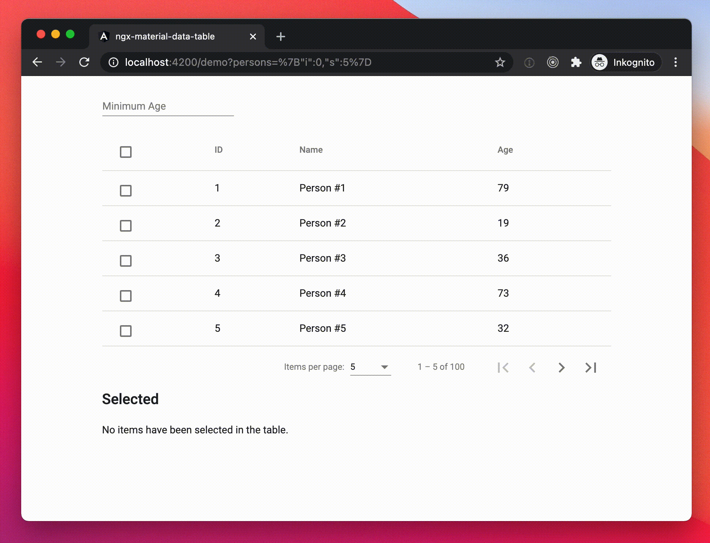

# ngx-material-data-table

This class enables you to create functional tables quickly based on
[`@angular/material/table`](https://material.angular.io/components/table)
without the need to write a lot of boilerplate code.
It includes the following features:

- Observable based data source
- Extendable config based on page, pageSize and optional orderBy
- Live persistance of table config in a query param
- Restoring of table config based on query param
- Clean component, just pass all options in the constructor
- Optional select column that works across pages
- Reuse Angular lifecycle hooks via
  [`NgxMaterialDataTableHooks`](./projects/ngx-material-data-table/src/lib/lifecycle-hooks.ts)

## Demo

### Run it yourself

1. `npm i`
2. `npm start`
3. Open [http://localhost:4200](http://localhost:4200)

## Installation

1. Make sure you have installed all peer dependencies and that you have a working
  [Angular Material Setup](https://material.angular.io/guide/getting-started)
  before using this component.
2. `npm i -E ngx-material-data-table`
3. Integrate the library in your project [as in the demo](./projects/demo)

## Contributing

Contributions via issues or Pull Requests are welcome!

When making commits, please follow the commit message guidelines from
[conventionalcommits.org](https://www.conventionalcommits.org).
This makes it easy to auto-generate a changelog.

Have a look at previous commits in this repo for examples.
